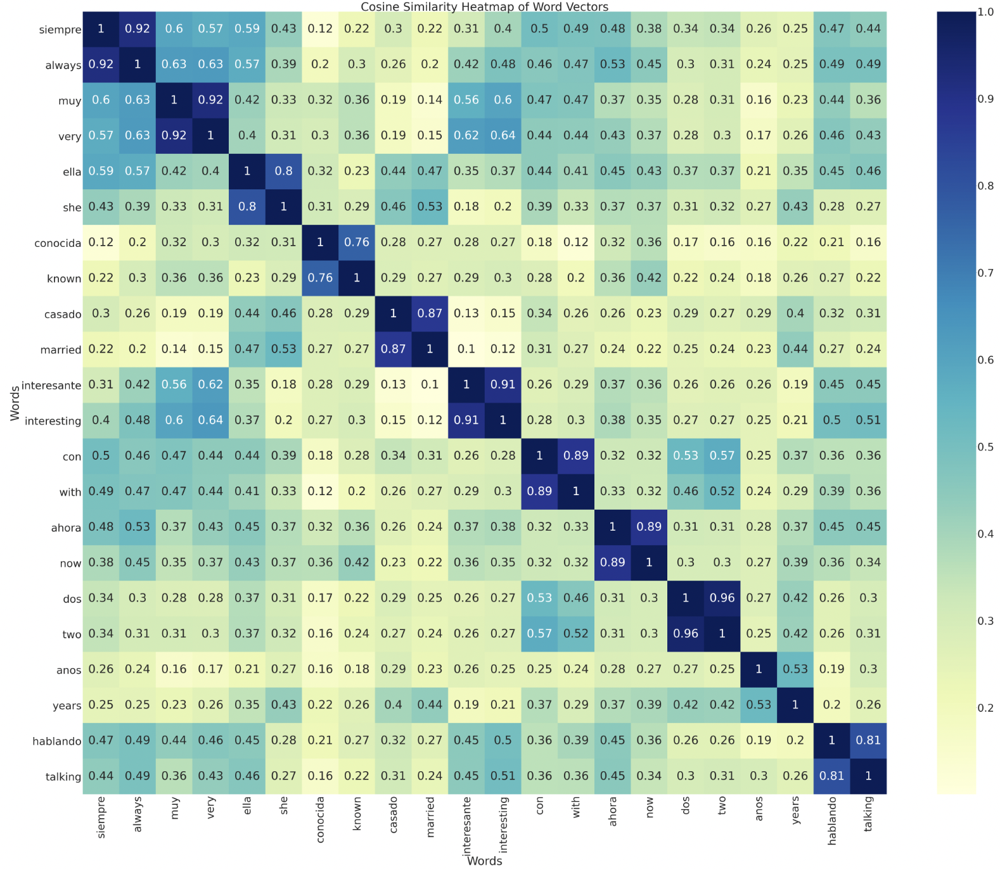
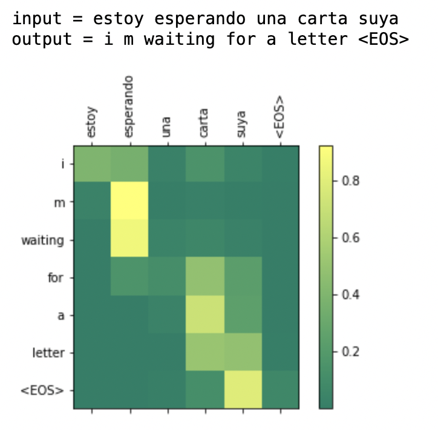

# Spanish to English Translation Using Numerical Linear Algebra

## Overview

This repository contains the code and documentation for a machine translation project focused on translating from Spanish to English. The project explores the application of Numerical Linear Algebra (NLA) techniques, specifically Singular Value Decomposition (SVD) and Long Short-Term Memory (LSTM) networks with an Attention Mechanism. Additionally, the state-of-the-art MarianMT model is used for comparison.

## Table of Contents

1. [Background](#background)
2. [Objectives](#objectives)
3. [Folders and Files](#folders-and-files)
4. [Dependencies](#dependencies)
5. [Setup and Installation](#setup-and-installation)
6. [Usage](#usage)
7. [Results](#results)

## Background

In the ever-evolving landscape of natural language processing, machine translation stands out as a pivotal field with profound implications for global communication. This project delves into the realm of Spanish to English translation, employing the techniques of Numerical Linear Algebra to enhance the precision and efficiency of the translation process.

## Objectives

- Implement machine translation models using SVD and LSTM with Attention.
- Evaluate model performance using BLEU and ROUGE metrics.
- Compare the results with the state-of-the-art MarianMT model.

## Folders and Files

- `data/`: Dataset files and preprocessed data.
- `SVD.ipynb`: Jupyter notebook containing the code for Spanish to English translation using SVD.
- `LSTM with Attention.ipynb`: Jupyter notebook containing the code for Spanish to English translation using LSTM with Attention.
- `SOTA.ipynb`: Jupyter notebook containing the code for Spanish to English translation using MarianMT.

## Dependencies

Ensure you have the following dependencies installed:

- Python 3.x
- Jupyter Notebook

## Setup and Installation

1. Clone the repository:
   ```bash
   git clone https://github.com/sohail2810/Machine-Translation.git
   ```
2. Navigate to the project directory:
   ```bash
   cd Machine-Translation
   ```
3. Install dependencies:
   ```bash
   pip install -r requirements.txt
   ```
4. Download GloVe embedding files from [here](https://drive.google.com/drive/folders/1_AuH1dyya8jPMs8L9rXacHsbYxT5SE86?usp=sharing) and store them in the `Machine-Translation` folder.

## Usage

Open the notebook you want to run and run all the cells. Approximate time taken for each notebook to reach completion:
1. SVD: 3 hours (Prediction is slow)
2. LSTM with Attention: 10 minutes
3. SOTA: 45 minutes

## Results

SVD Results:
   1. BLEU score: `12.86` 
   2. ROUGE-1 score: `51.12`
   3. ROUGE-2 score: `22.33`
   4. ROUGE-L score: `48.27`
   

   

LSTM with Attention Results:
   1. BLEU score: `50.18` 
   2. ROUGE-1 score: `74.68`
   3. ROUGE-2 score: `55.58`
   4. ROUGE-L score: `73.94`


   

SOTA(MarianMT) Results:
   1. BLEU score: `58.47` 
   2. ROUGE-1 score: `80.74`
   3. ROUGE-2 score: `64.47`
   4. ROUGE-L score: `79.31`

   
   
A comparison of the results from above methods is shown here
| Model                  | BLEU  | ROGUE-1 | ROGUE-2 | ROGUE-L |
|------------------------|-------|---------|---------|---------|
| SVD                    | 12.86 | 51.12   | 22.33   | 48.27   |
| LSTM with Attention    | 50.18 | 74.68   | 55.58   | 73.94   |
| MarianMT               | 58.47 | 80.74   | 64.47   | 79.31   |

